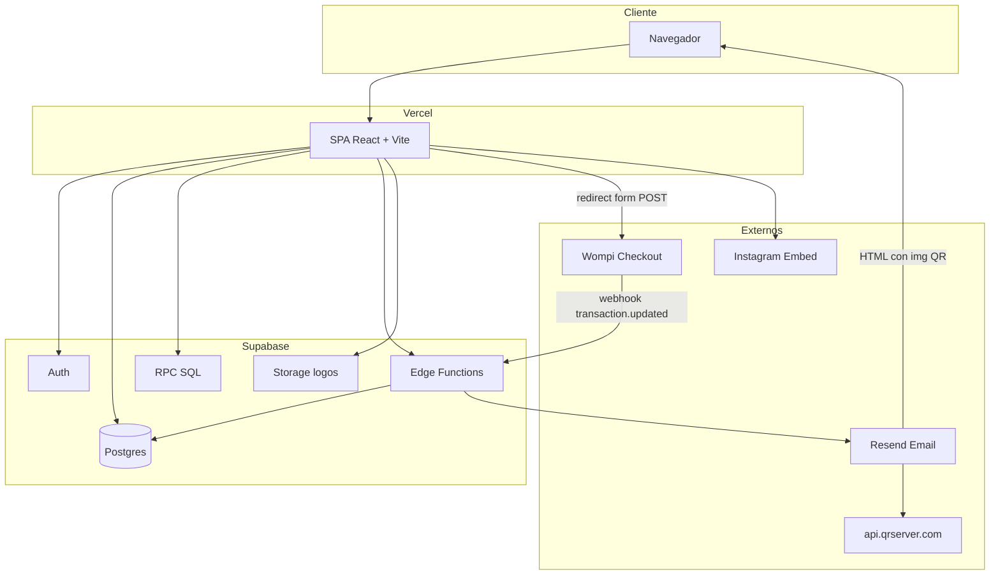
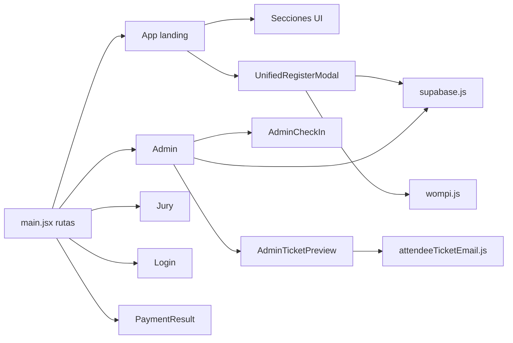
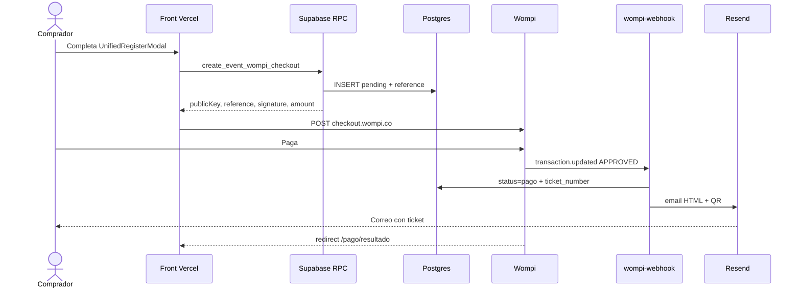

# 01 · Arquitectura

## Stack

| Capa | Tecnología | Dónde |
|------|------------|--------|
| Frontend | React 18, Vite 6, React Router 7 | `src/` · deploy Vercel |
| Estilos | CSS modules por componente + tokens | `src/styles/`, `*.css` |
| Datos estáticos CMS | JS export | `src/data/content.js` |
| BaaS | Supabase Auth / DB / Storage / Functions | `supabase/` |
| Pagos | Wompi Web Checkout | `src/lib/wompi.js` + RPC |
| Email | Resend | Edge `wompi-webhook`, `resend-ticket`, `notify-registration` |

## Capas del frontend

## Rutas

| Ruta | Rol |
|------|-----|
| `/`, `/boleta`, `/boleta/:seatType` | Landing + deep link compra |
| `/pago/resultado` | Retorno Wompi |
| `/login`, `/registro` | Auth |
| `/admin` | Admin |
| `/jurado` | Jurado |
| `/resultados-vivo` | Redirect a `/` (desactivado) |

## Flujo de alto nivel: compra de boleta

## Entornos y secretos

**Front (`VITE_*`):** URL/anon Supabase, public key Wompi.  
**Edge / Dashboard:** `WOMPI_EVENTS_SECRET`, `RESEND_API_KEY`, `RESEND_FROM`, `PUBLIC_SITE_URL`, service role.  
**Postgres privado:** secrets integrity Wompi (RPC checkout).

## Hosting

- Front: Vercel (`vercel.json` rewrite SPA).
- Backend: proyecto Supabase (functions + SQL Editor manual, no migraciones CLI obligatorias).
