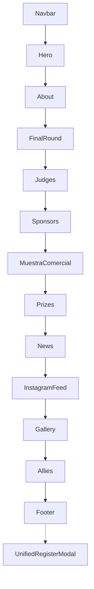

# 02 · Componentes

## Diagrama: landing actual (`App.jsx`)

## Activos (en uso)

| Componente | Función |
|------------|---------|
| `Navbar` | Nav + CTA registro |
| `Hero` | Carrusel imagen / Preferencial / General |
| `About` | Qué es el evento |
| `FinalRound` | Semifinalistas 2026 + info Gran Final |
| `Judges` | Jurados + videos IG (embed) |
| `Sponsors` | Planes patrocinio |
| `MuestraComercial` | Stands |
| `Prizes` | Premios |
| `News` | Prensa |
| `InstagramFeed` | Feed embeds |
| `Gallery` | Álbum lightbox |
| `Allies` | Logos |
| `Footer` | Pie |
| `Ticket` | Shell visual boleto |
| `UnifiedRegisterModal` | Registro + pago (único modal vivo) |
| `Login` / `Signup` | Auth |
| `Admin` | Panel completo |
| `AdminCheckIn` | QR check-in + modal feedback |
| `AdminTicketPreview` | Preview + PDF físicos |
| `Jury` / `Juicio2Ronda` / `JuryRound2Results` | Portal y scores 2ª ronda |
| `PaymentResult` | Post-pago Wompi |
| `Ventures` (named) | Grid/modal reutilizado en FinalRound |

## Comentados en App (legacy reactivable)

`Competition`, `PitchRound`, `Editions`, `Entradas`, `Testimonials`, `Contact`, default `Ventures`.

## Huérfanos (0 imports)

`AttendeeModal`, `SponsorModal`, `ExhibitorModal`, `RegisterModal` (CSS sí lo usa Unified), `ClosedCompetitorModal`, `LiveRound2Results`.

## Libs de UI (no son “componentes de sección”)

| Archivo | Uso |
|---------|-----|
| `src/lib/supabase.js` | API datos / auth / RPC / resend |
| `src/lib/wompi.js` | Redirect checkout |
| `src/lib/attendeeTicketEmail.js` | HTML boleta |
| `src/data/content.js` | Textos y config UI |

## Dónde está Wompi / Resend en componentes

| Integración | ¿En componentes? | Detalle |
|-------------|------------------|---------|
| **Wompi checkout** | Sí, vía modal | `UnifiedRegisterModal` → `createEventWompiCheckout` → `redirectToWompiCheckout` |
| **Wompi resultado** | Sí | `PaymentResult` consulta estado |
| **Wompi webhook** | No (servidor) | Edge `wompi-webhook` |
| **Resend envío ticket** | No (servidor) | Edge `wompi-webhook` y `resend-ticket` |
| **Resend disparo UI** | Sí | Admin botón **Reenviar ticket** → `resendAttendeeTicket()` |
| **Notify inscripción** | Indirecto | `supabase.js` invoca `notify-registration` |

Ver detalle en [04 · Wompi y Resend](./04-wompi-resend.md).
