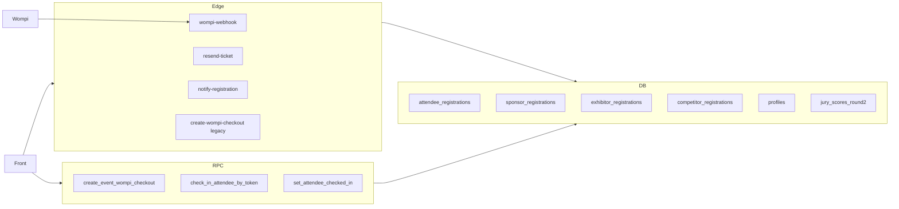

# 03 · Supabase

## Piezas



## Tablas principales (asistentes / pagos)

| Tabla | Uso |
|-------|-----|
| `attendee_registrations` | Boletas: datos, `seat_type`, `status`, Wompi, `ticket_number`, `ticket_token`, `checked_in_at` |
| `sponsor_registrations` | Patrocinadores |
| `exhibitor_registrations` | Stands |
| `competitor_registrations` | Concursantes / etapas / logos |
| `profiles` | Roles `admin` / `jurado` |
| `jury_scores_round2` | Calificaciones 2ª ronda |

## Triggers / columnas clave boleta

- Al pasar a `status = 'pago'` → trigger asigna `ticket_number` (`attendee_ticket_number.sql`).
- `ticket_token` UUID único para QR (`attendee_checkin.sql`).
- Inventario físico marcado con `payment_confirmation = 'FISICO:INVENTARIO'`.

## Edge Functions

| Function | Quién la llama | Qué hace |
|----------|----------------|----------|
| `wompi-webhook` | Wompi | Valida firma, marca pago, envía Resend |
| `resend-ticket` | Admin / SQL service_role | Reenvía HTML ticket |
| `notify-registration` | Front tras insert | Avisos email inscripción |
| `create-wompi-checkout` | Legacy | Sustituido en flujo actual por RPC |

## Scripts SQL (carpeta `supabase/`)

Ejecución **manual** en SQL Editor. Ver lista completa en el resumen raíz; los críticos de boletas:

1. `attendee_sponsor_registrations.sql`
2. `wompi_*` + `create_event_wompi_checkout.sql`
3. `attendee_ticket_number.sql`
4. `attendee_checkin.sql`
5. `physical_ticket_inventory.sql`

## Roles

```mermaid
flowchart TB
  User[Usuario Auth] --> Profile{profiles.role}
  Profile -->|admin| AdminUI[/admin]
  Profile -->|jurado| JuryUI[/jurado]
  Profile -->|otro| Public[Landing pública]
```
