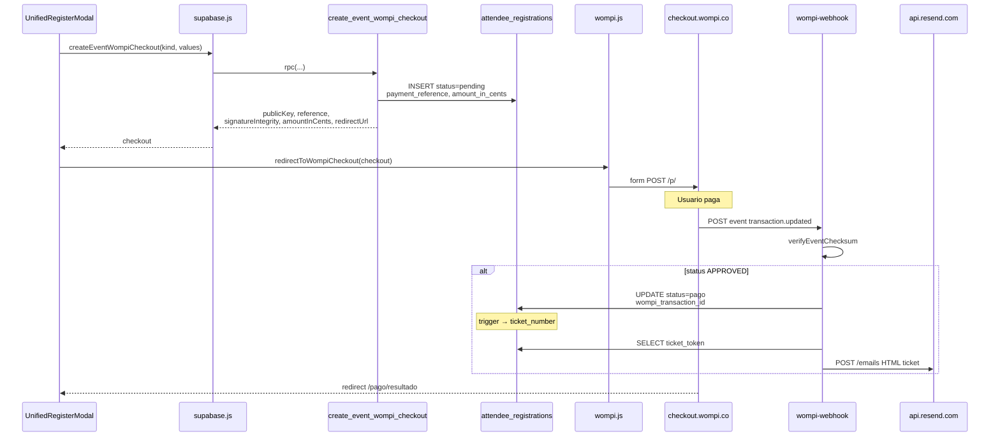
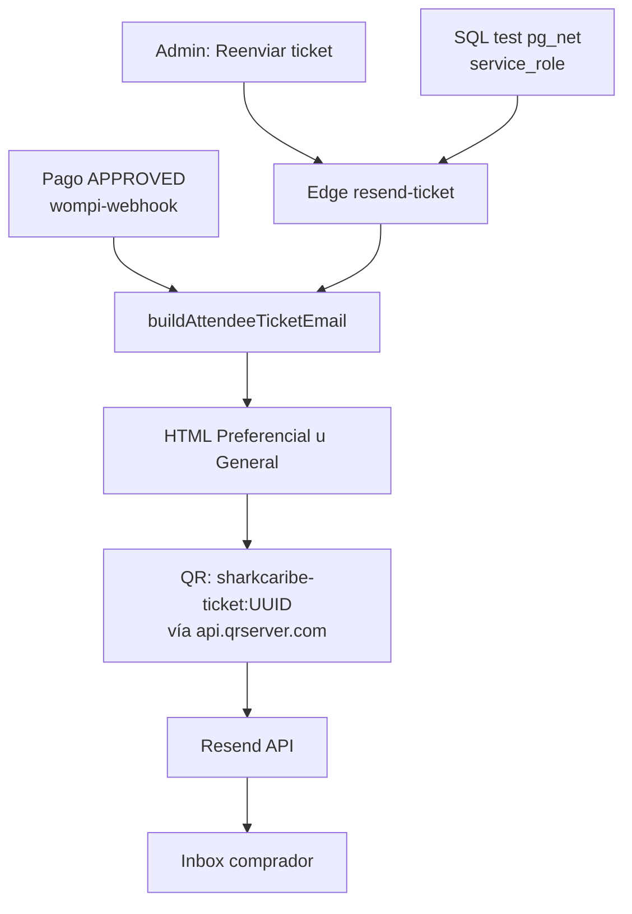
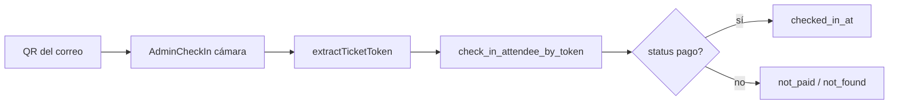

# 04 · Wompi y Resend

Estas integraciones **no son componentes visuales**: viven en `src/lib`, RPC SQL y Edge Functions. Los componentes solo las disparan.

## Quién usa qué

| Pieza | Capa | Archivo / Function |
|-------|------|--------------------|
| Crear checkout firmado | RPC Postgres | `create_event_wompi_checkout` |
| Abrir checkout en browser | Front lib | `src/lib/wompi.js` → `redirectToWompiCheckout` |
| Disparo UI compra | Componente | `UnifiedRegisterModal.jsx` |
| Resultado en pantalla | Componente | `PaymentResult.jsx` |
| Confirmación de pago | Edge | `wompi-webhook` |
| Envío ticket al pagar | Edge + Resend | `wompi-webhook` → API Resend |
| Reenvío ticket | Edge + Resend | `resend-ticket` |
| Botón reenviar | Componente | `Admin.jsx` → `resendAttendeeTicket` |
| Aviso inscripción | Edge + Resend | `notify-registration` |

## Flujo Wompi (compra)

### Montos típicos asistentes (centavos COP)

| Tipo | amount_in_cents | Precio UI |
|------|-----------------|-----------|
| Preferencial | `7990000` | COP $79.900 |
| General | `5000000` | COP $50.000 |

(Definidos en RPC / content; pruebas pueden usar RPC de $1.000.)

### Secrets Wompi

- Front: `VITE_WOMPI_PUBLIC_KEY`
- Edge webhook: `WOMPI_EVENTS_SECRET` (firma eventos)
- DB privada: integrity secret para firmar checkout (RPC)

## Flujo Resend (correo ticket)

### Plantilla del ticket

| Capa | Archivo |
|------|---------|
| Fuente de verdad (front) | `src/lib/attendeeTicketEmail.js` |
| Shared Edge | `supabase/functions/_shared/attendeeTicketEmail.ts` |
| Inline webhook / resend | Marcadores `/* ===== plantilla ticket ===== */` |
| Sync | `node scripts/sync-ticket-plantilla.mjs` |

Tras cambiar diseño: sync + **redesplegar** `wompi-webhook` y `resend-ticket`.

### Secrets Resend

- `RESEND_API_KEY`
- `RESEND_FROM` (ej. `Shark Caribe <noreply@sharkcaribe.co>`)
- `PUBLIC_SITE_URL` (base de logos/Sharky en el HTML)

### Pruebas SQL

- `supabase/test_ticket_to_juan.sql`
- `supabase/test_ticket_resend.sql`

## Check-in (después del correo)

El token manual en Admin usa el mismo parser/RPC.
