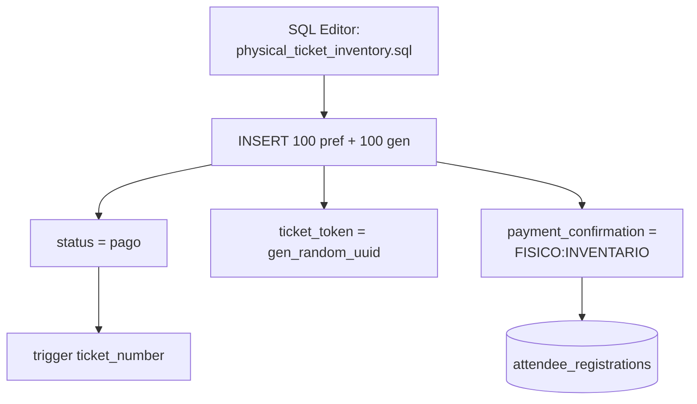
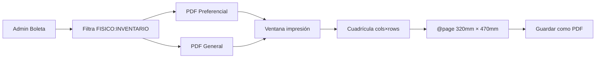
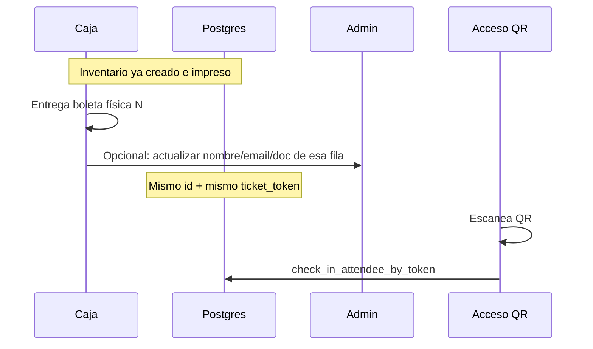

# 05 · Boletas físicas y PDF

## Objetivo

Generar **100 Preferencial + 100 General** en base de datos (pagadas, numeradas, con QR único) e imprimirlas en hoja **32 × 47 cm** en cuadrícula, sin solapes.

## 1) Crear inventario en Postgres

Script: `supabase/physical_ticket_inventory.sql`

### Identificadores

| Campo | Preferencial | General |
|-------|--------------|---------|
| `document_number` | `FIS-PREF-001…100` | `FIS-GEN-001…100` |
| `payment_confirmation` | `FISICO:INVENTARIO` | igual |
| Email placeholder | `fisico.pref.NNN@boleta.fisica.local` | `fisico.gen.…` |

Idempotente: no duplica si ya existen esos documentos.

### Riesgos operativos

- Cuentan como **pagadas** en reportes.
- El QR **funciona** aunque no se hayan “vendido” en caja → cuidar el stock físico.
- No hay tope automático vs venta online.

## 2) Generar PDF desde Admin

UI: **Admin → Boleta → Inventario físico para imprenta**  
Código: `AdminTicketPreview.jsx`

### Layout de impresión

| Parámetro | Valor |
|-----------|--------|
| Hoja | **32 × 47 cm** (320 × 470 mm) |
| Distribución | Máximo automático, o 2 / 3 columnas |
| Orden | Izquierda→derecha, luego fila de abajo (grid) |
| Contenido | Misma plantilla HTML del correo (sin saludo) |
| QR | Uno **distinto** por boleta (`ticket_token`) |

### Tamaño aproximado de cada boleta impresa

Depende de la escala automática (el hint de la ventana muestra `escala X%`):

- Ancho ≈ `14,8 cm × escala`
- Alto Preferencial ≈ tipicamente **9–11 cm** en modo máximo

Ej.: escala 32% → ~**4,7 cm** de ancho.

### Diálogo del navegador

Si el PDF no sale en 32×47:

1. Imprimir → Guardar como PDF  
2. Papel: **Personalizado 320 × 470 mm**  
3. Márgenes mínimos  

## 3) Flujo de venta en caja (recomendado)

## 4) Relación con boletas online

| Origen | Cómo se crea | Cómo se imprime / entrega |
|--------|--------------|---------------------------|
| Online Wompi | Checkout + webhook | Email Resend (y opcional PDF unitario) |
| Física inventario | SQL seed | PDF masivo Admin 32×47 |
| Reimpresión online | — | Admin → Ver boleta / reenviar correo |

Misma plantilla: `attendeeTicketEmail.js`.
